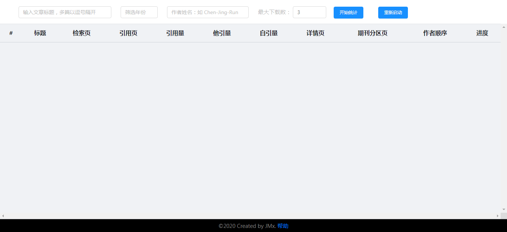
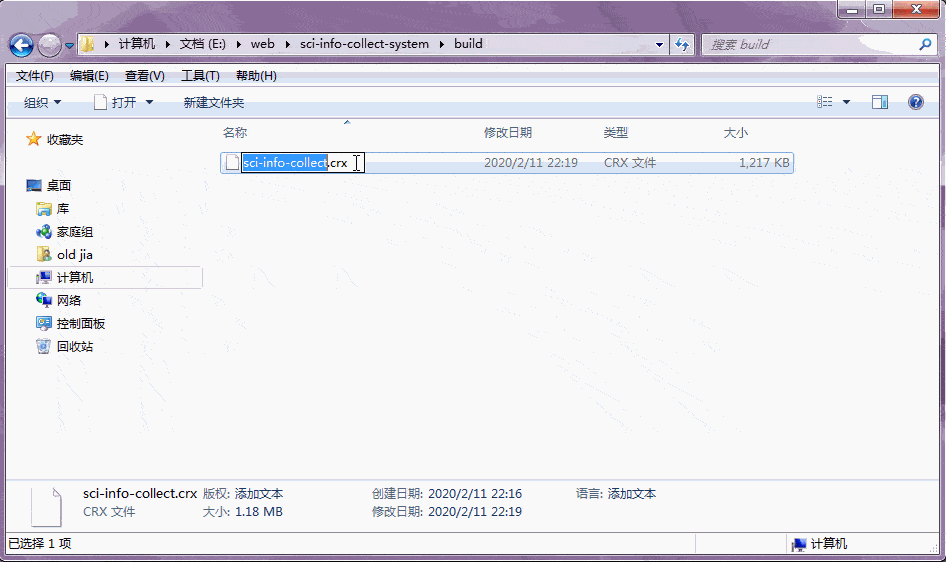

<!-- MarkdownTOC -->

- 科研成果统计系统
	- 操作界面
		- 初始状态
		- 工作状态
	- 使用教程
		- 安装插件
		- 开始使用
			- 输入
			- 输出
		- 整体演示
	- 设计流程图
	- 第三方库
	- Q&A
	- Todos

<!-- /MarkdownTOC -->
[TOC]

## 科研成果统计系统

这是一款运行在使用Chromium内核的浏览器上(如：360极速浏览器，Google Chrome浏览器，Opera浏览器，QQ浏览器。但不支持IE，Firefox等非Chromium内核的浏览器)的插件，主要用于统计科研成果。

### 操作界面

#### 初始状态

#### 工作状态

### 使用教程

#### 安装插件

首先将插件解压缩

然后将解压后的插件安装到浏览器。不同浏览器的安装方法如下

**360极速浏览器(测试版本：12.0)**：

**Opera浏览器(测试版本：64.0.3417.61)：**

**Chrome浏览器(测试版本：74.0.3729.131)：**

**QQ浏览器(版本：10.5.2)：**

#### 开始使用

##### 输入 

1. 文章标题列表：title1 && title2 && title3 && ...

   两个标题间以‘&&’隔开。

2. 年份：2018, 2019，...

   用以筛选特定时间内引用这篇文献的论文，不同年份以逗号隔开。

3. 作者姓名：Chen-Jing-Run

   输入姓名拼音，首字母均大写且以短横杠隔开。
   
4. 最大下载数：1-10之间，默认为3.

    可以同时搜索多个文章。但由于每一次搜索都会打开一个浏览器标签页，因此，最大下载数越大，同时打开的标签页也就越多，所需计算机资源也就越多，因此要视计算机性能而定，并不是越多越好。

##### 输出 

1. 检索页：成功/出错。如果出错，可能情况是检索不到/检索到多个结果。
2. 引用页：成功/出错。指定年份的引用页。
3. 引用量：整数。指定年份的总引用量。
4. 他引量：整数。指定年份的他引量。
5. 自引量：整数。指定年份的自引量。
6. 详情页：成功/出错。
7. 期刊分区页：成功/出错。
8. 作者顺序：整数。指定姓名在检索结果作者列表中的位置。
9. 进度：空/完成。

#### 整体演示

### 设计流程图 

### 第三方库

1. React：create-react-app.
3. Antd.
3. Booststrap.
4. Chrome插件运行环境.
5. 上述库的若干依赖.

### Q&A

1. 软件运行较慢？

   由于数据是从[Web of Science](http://apps.webofknowledge.com/)获取，而其服务器在国外，因此访问速度较慢。此外，软件还受网速的影响。

2. 软件是否可以一直使用？

   不可以。由于数据是从[Web of Science](http://apps.webofknowledge.com/)获取，如果该网站更新系统，则软件可能无法正常使用。后续会提供更新。
   
3. **bug提交**

    请发送遇到的问题(建议附上表格截图)至​**e-mail**：jiaminxin@outlook.com。

### Todos

1. 登录中科院分区系统，根据杂志名过去分区信息。

    由于中科院分区表网站登录时设置了人机验证，因此目前无法后台获取查询权限，需要用户登录来获取查询权限。
